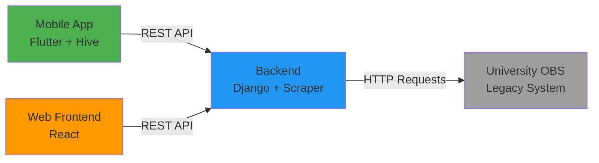

# OBS Student Information System - Project Presentation
**Multi-Tenant Offline-First University Management Platform**

---

## 📋 Project Overview

**Problem Statement:**
- University OBS (Student Information System) websites are often slow, outdated, and lack mobile support
- Students need offline access to their academic data (grades, attendance, schedules)
- Universities want branded, customizable solutions without building from scratch

**Our Solution:**
A **White-Label SaaS Platform** that:
- Scrapes existing university OBS systems (temporary adapter layer)
- Provides modern REST API for mobile/web frontends
- Supports offline-first architecture for instant data access
- Deploys separately per university with zero code changes

---

## 🏗️ Architecture: "The Facade Pattern"



### Key Principle: **Zero Breaking Changes**
When we migrate from Scraper → PostgreSQL database:
- Mobile app code: **0 lines changed**
- Web frontend code: **0 lines changed**
- Only backend internal implementation changes

---

## 🛠️ Technical Stack

### Backend
- **Framework:** Django REST Framework (migrating from Vercel serverless)
- **Data Source:** BeautifulSoup4 scraper (temporary) → PostgreSQL (future)
- **Deployment:** VPS with Docker
- **Architecture:** Interface-based service layer (Scraper/DB swappable)

### Mobile App
- **Framework:** Flutter
- **State Management:** Riverpod (Code Generation)
- **Offline Storage:** Hive (NoSQL local database)
- **Pattern:** Repository Pattern + Stale-While-Revalidate
  - Show cached data instantly
  - Fetch fresh data in background
  - Update UI when ready

### Web Frontend
- **Framework:** React (planned)
- **Styling:** Modern CSS / Tailwind
- **Auth:** Token-based (shared with mobile)

---

## 🎯 Multi-Tenant SaaS Model

**Deployment Strategy:** Separate instance per university

| University | Backend URL | Mobile App | Config |
|------------|-------------|------------|--------|
| Turgut Özal Üni | `obs-ozal.example.com` | "OBS Özal" | `tenants/ozal.json` |
| X University | `obs-xuni.example.com` | "OBS X" | `tenants/xuni.json` |

**Build-Time Configuration:**
```json
{
  "tenant_id": "ozal",
  "institution_name": "Turgut Özal Üniversitesi",
  "obs_urls": {
    "base": "https://obs.ozal.edu.tr/oibs/std/",
    "login": "...",
    "grades": "..."
  },
  "modules": {
    "grades": {"enabled": true, "show_gpa": true},
    "attendance": {"enabled": true},
    "library": {"enabled": false}
  }
}
```

**Phased Customization:**
- **90% of tenants:** JSON config changes only (URLs, selectors, colors)
- **10% edge cases:** Custom scraper classes via Strategy Pattern

---

## ✅ Current Status

### Completed Features
- ✅ **Authentication Module**
  - Captcha solving (base64 image transfer)
  - Session cookie relay mechanism (stateless backend)
  - Secure login flow with hidden form data handling

- ✅ **Mobile App Foundation**
  - Clean Architecture (Features/Data/Domain/Presentation)
  - Hive offline storage configured
  - Riverpod state management setup

- ✅ **Backend Prototype**
  - Working scraper for Turgut Özal University OBS
  - Standard Envelope response format
  - Defensive parsing with error handling

### In Progress
- 🔄 **Django Migration**
  - Moving from Vercel serverless → persistent VPS server
  - Implementing tenant configuration system
  - Building interface-based scraper service

---

## 🗺️ Roadmap

### Phase 1: Foundation (Current - Week 4)
- [x] Auth implementation (Scraper-based)
- [x] Architecture design (Facade + Offline-First)
- [ ] Django REST Framework setup
- [ ] Tenant configuration system

### Phase 2: Core Modules (Week 5-8)
- [ ] **Grades Module**
  - Backend: Scraper + serializers
  - Mobile: Hive models + Repository + UI
- [ ] **Attendance Module**
- [ ] **Course Schedule Module**

### Phase 3: Advanced Features (Week 9-12)
- [ ] Exam results tracking
- [ ] GPA calculator
- [ ] Document download (transcripts, certificates)
- [ ] Push notifications (exam announcements)

### Phase 4: PostgreSQL Migration (Week 13-16)
- [ ] Design database schema
- [ ] Implement DatabaseDataSource (replaces Scraper)
- [ ] Data migration tools
- [ ] **Zero breaking changes for clients** ✨

### Phase 5: Web Frontend (Week 17-20)
- [ ] React app with same API
- [ ] Responsive design (desktop/tablet)
- [ ] Admin dashboard for universities

---

## 💡 Competitive Advantages

### For Universities
1. **Fast Deployment:** 1-2 weeks setup (vs 6+ months custom development)
2. **Cost-Effective:** Shared codebase reduces maintenance costs
3. **Brand Customization:** White-label solution with university colors/logos
4. **Gradual Migration:** Works with existing OBS, no need to replace immediately

### For Students
1. **Offline Access:** Check grades without internet
2. **Modern UX:** Clean, fast mobile interface
3. **Cross-Platform:** iOS, Android, Web (future)
4. **Privacy:** Data stored locally, not on third-party servers

### For Us (Technical Excellence)
1. **Scalable Architecture:** Adding new university = config file + deployment
2. **Future-Proof:** Scraper → DB migration planned with zero client impact
3. **Extensible:** Plugin system for custom features per tenant
4. **Clean Code:** Interface-based design, testable components

---

## 🔐 Security Considerations

- **No Password Storage:** Cookies relayed to mobile, not stored on backend
- **HTTPS Only:** All API communication encrypted
- **Input Validation:** Defensive parsing of scraped HTML
- **Secret Management:** Environment variables for sensitive data (future: Vault)

---

## 📊 Success Metrics

### Technical KPIs
- API response time: < 2 seconds
- App cold start: < 1 second (cached data)
- Uptime: 99.5%
- Scraper success rate: > 95%

### Business KPIs
- Target: 3 universities in first 6 months
- 500+ active students per university
- Customer retention: > 80%

---

## 🚀 Next Steps (This Week)

1. Complete Django migration
2. Implement Grades module backend
3. Build Grades UI in mobile app
4. Prepare demo video for client pitch

---

## 🤝 Team & Contribution

**Current Team:**
- Backend Development (Django + Scraper)
- Mobile Development (Flutter)
- Architecture & DevOps

**Open Opportunities:**
- Web Frontend Developer (React)
- UI/UX Designer (Mobile redesign)
- QA Engineer (Test automation)

---

## 📞 Contact & Demo

**Repository:** [GitHub Organization - OBS Project]
**Demo Environment:** `demo.obs-project.com` (coming soon)
**Documentation:** [Docs Portal Link]

---

> **Mission Statement:**
> Democratizing access to modern student information systems for universities of all sizes, one deployment at a time.

